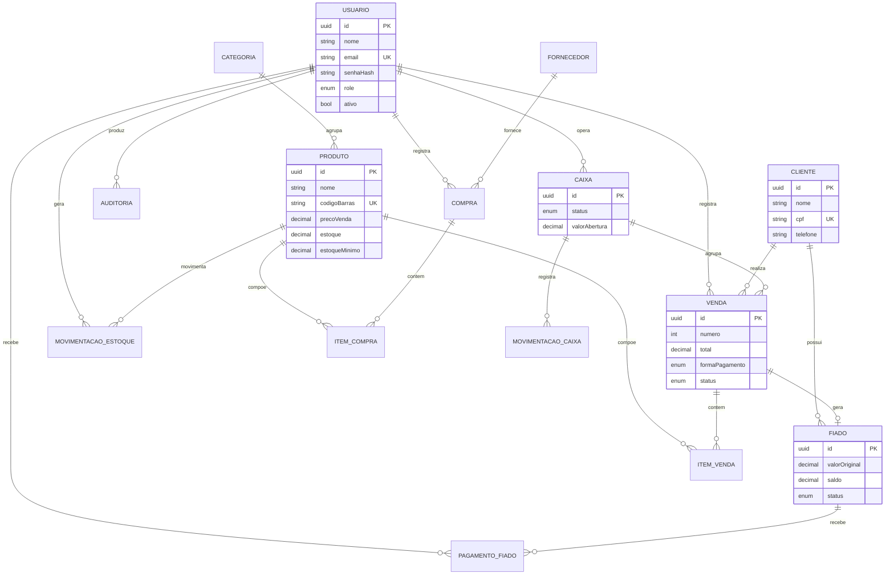
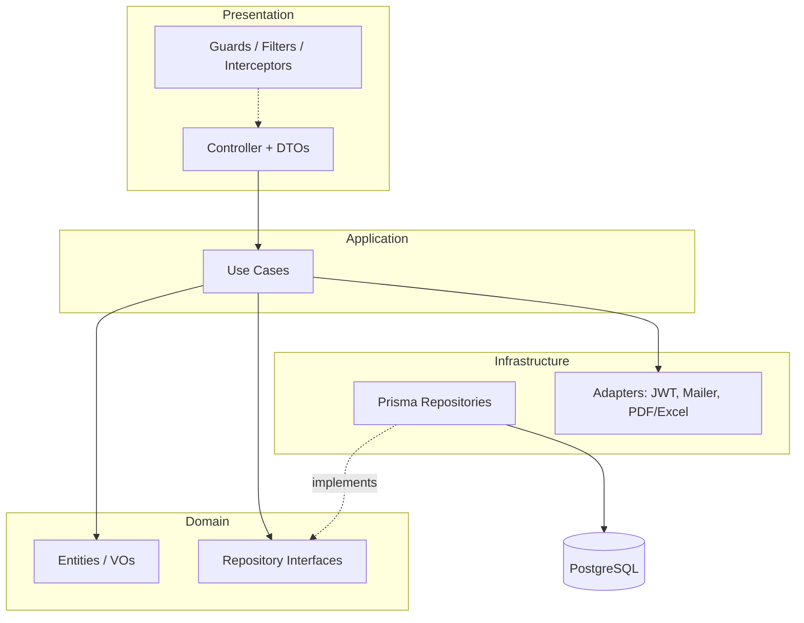
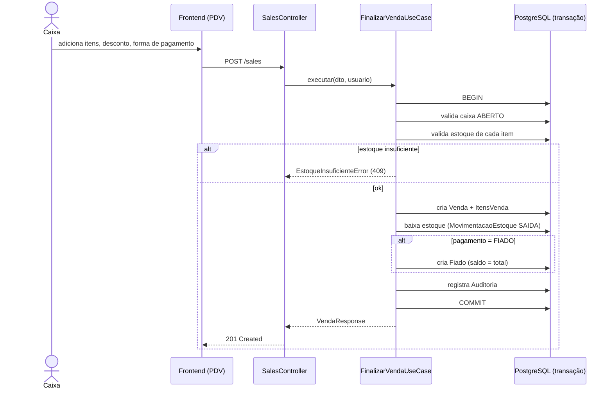
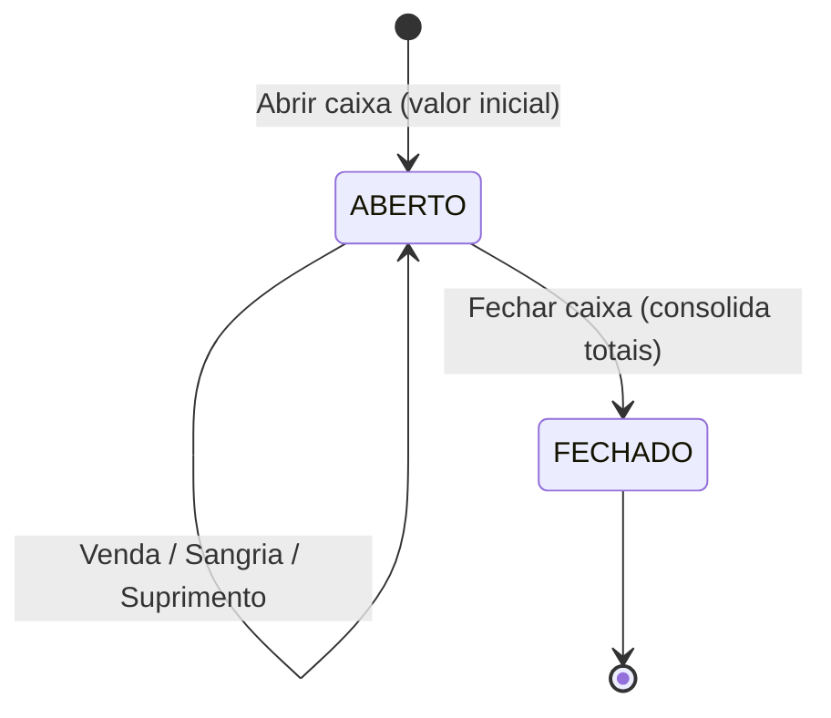

# 05 — Diagramas

> Diagramas em [Mermaid](https://mermaid.js.org). Renderizam no GitHub/VS Code.

## Diagrama Entidade-Relacionamento (ER)



## Diagrama de camadas (Clean Architecture)



## Fluxo — Finalizar Venda (PDV)



## Fluxo — Pagamento de Fiado

```mermaid
sequenceDiagram
    actor Operador
    participant API as CreditController
    participant UC as RegistrarPagamentoUseCase
    participant DB as PostgreSQL

    Operador->>API: POST /credit/:id/payments {valor}
    API->>UC: executar
    UC->>DB: carrega Fiado
    UC->>UC: valida valor <= saldo
    UC->>DB: cria PagamentoFiado
    UC->>DB: valorPago += valor; saldo = original - pago
    UC->>DB: status = (saldo==0 ? QUITADO : PARCIAL)
    UC-->>API: FiadoResponse
```

## Fluxo — Ciclo do Caixa


