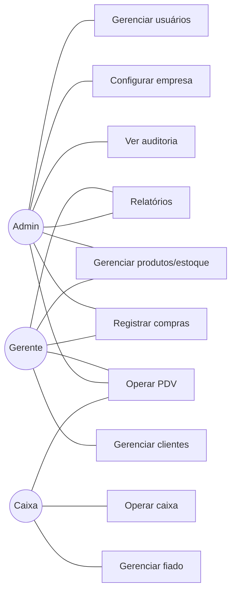

# 06 — Casos de Uso

Atores: **Administrador (A)**, **Gerente (G)**, **Caixa (C)**.

## Diagrama de casos de uso (visão geral)

---

## Autenticação

- **UC-AUTH-01 Login:** informar email/senha → recebe access + refresh token. Bloqueio após N tentativas.
- **UC-AUTH-02 Logout:** revoga refresh token / encerra sessão.
- **UC-AUTH-03 Recuperar senha:** solicita por email → token temporário → redefine senha.
- **UC-AUTH-04 Renovar sessão:** refresh token → novo access token.

## Usuários (A)

- **UC-USR-01** Criar usuário (nome, email, perfil, senha temporária).
- **UC-USR-02** Editar usuário / alterar perfil.
- **UC-USR-03** Ativar/inativar usuário.
- **UC-USR-04** Listar usuários (filtros, paginação).

## Clientes (A, G)

- **UC-CLI-01** Cadastrar cliente.
- **UC-CLI-02** Editar/inativar cliente.
- **UC-CLI-03** Ver histórico de compras.
- **UC-CLI-04** Ver histórico e saldo de fiado.

## Produtos & Categorias (A, G)

- **UC-PRD-01** Cadastrar produto (com categoria, preços, estoque inicial, unidade).
- **UC-PRD-02** Editar/inativar produto.
- **UC-PRD-03** Buscar produto por nome/código/código de barras.
- **UC-CAT-01** Gerenciar categorias.

## Estoque (A, G)

- **UC-EST-01** Registrar entrada manual.
- **UC-EST-02** Ajuste de estoque (correção com motivo).
- **UC-EST-03** Ver alerta de estoque mínimo.
- **UC-EST-04** Consultar histórico de movimentações (filtros por produto/período/tipo).
- *Saída automática ocorre na venda (UC-VEN-05).*

## Vendas / PDV (A, G, C)

- **UC-VEN-01** Buscar e adicionar produto (por nome/código/código de barras).
- **UC-VEN-02** Alterar quantidade de item.
- **UC-VEN-03** Remover item.
- **UC-VEN-04** Aplicar desconto na venda.
- **UC-VEN-05** Finalizar venda (Dinheiro/PIX/Cartão/Fiado) → baixa estoque, vincula ao caixa.
- **UC-VEN-06** Cancelar venda (estorna estoque). *(A, G)*

**Pré-condições:** caixa aberto; estoque suficiente; se FIADO, cliente selecionado.

## Fiado (A, G, C)

- **UC-FIA-01** Registrar venda fiado (deriva de UC-VEN-05).
- **UC-FIA-02** Consultar saldo devedor do cliente.
- **UC-FIA-03** Registrar pagamento (total/parcial).
- **UC-FIA-04** Ver histórico de pagamentos.
- **UC-FIA-05** Listar clientes inadimplentes.

## Fornecedores (A, G)

- **UC-FOR-01** Cadastrar fornecedor.
- **UC-FOR-02** Editar/inativar fornecedor.

## Compras (A, G)

- **UC-COM-01** Registrar compra (fornecedor, itens, quantidades, preços) → entrada automática no estoque.
- **UC-COM-02** Consultar histórico de compras.

## Caixa (A, G, C)

- **UC-CX-01** Abrir caixa (valor inicial).
- **UC-CX-02** Registrar sangria/suprimento.
- **UC-CX-03** Fechar caixa (consolidar e conferir).
- **UC-CX-04** Consultar histórico de caixas.

## Dashboard (A, G, C — conforme perfil)

- **UC-DSH-01** Ver indicadores: vendas do dia/mês, faturamento, estoque baixo, fiado em aberto, últimas vendas.
- **UC-DSH-02** Ver gráficos: vendas por período, produtos mais vendidos.
- **UC-DSH-03** Ver indicadores de fiado: total em fiado, total recebido, inadimplentes.

## Relatórios (A, G)

- **UC-REL-01** Gerar relatório (vendas, produtos, estoque, compras, clientes, fiado) com filtros de período.
- **UC-REL-02** Exportar em PDF.
- **UC-REL-03** Exportar em Excel.

## Auditoria (A)

- **UC-AUD-01** Consultar trilha de ações (usuário, data, ação, entidade), com filtros.

## Configurações (A)

- **UC-CFG-01** Editar dados da empresa e logotipo.
